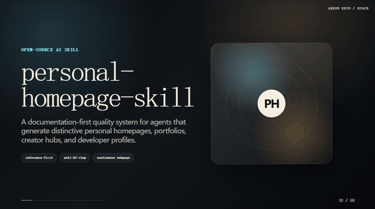

<p align="center">
  <a href="https://github.com/shengjidaguai-china"><strong>升级打怪开源社区</strong></a> 首批开放共建项目 ·
  <a href="https://github.com/shengjidaguai-china">点击组织首页右上角 <strong>Follow</strong></a>，及时获取新项目与共建活动
</p>

# Personal Homepage Skill

一个让 AI Agent 稳定生成高质量个人主页、作品集和 HTML PPT 的 Skill + 模板库。

An AI Skill + template gallery for generating polished personal homepages, portfolios, and HTML presentations with Claude Code / AI coding agents.


> 如果这个项目帮助你生成了更好的个人主页、作品集、创作者主页或 HTML 演示文稿，欢迎点一个 ⭐ Star。



## Template demos

精选 4 个代表性输出：星球空间、潮玩手办、电影感主页和可直接分享的神经 AI Hero 主页。

### 01 · Orbis NFT Space Landing


### 02 · TOONHUB Figurine Carousel


### 03 · Cinematic Scroll Personal Brand


### 04 · Hero Neural Cinematic Homepage


这套完整模版内置原版视频与静态尾屏照片。用户提供姓名、介绍、项目或视频时替换对应内容；未提供的视频继续使用模版素材。`templates/hero/portable/index.html` 可以直接双击打开，整个 `portable` 文件夹压缩后即可发送给其他人。

## 可以生成什么？

- 个人主页 / personal homepage
- 作品集网站 / portfolio website
- 求职主页 / resume homepage
- 创作者主页 / creator homepage
- 开发者 / 设计师作品集
- 艺术 / 摄影作品集
- 个人项目展示页
- 16:9 HTML PPT / 浏览器演示文稿

## 为什么需要它？

很多 AI 生成的个人展示页都会变成同一种廉价模板：

- 首屏文案空泛，看不出这个人是谁
- 到处是紫色渐变和随机发光球
- 技能区只是 logo 墙
- 项目卡片没有问题、角色、功能、结果
- 编造虚假指标和虚假评价
- 用户给的视觉参考被忽略
- 页面缺少统一的视觉系统和内容层次

`personal-homepage-skill` 的目标是让 Agent 在生成个人主页或 HTML 演示文稿时遵守按需加载的独立流程：先理解人和内容目标，再跟随参考，再组织信息架构，最后做视觉和内容质量检查。

## 项目包含什么？

- AI Skill 主入口与生成规则
- Reference-first 个人主页生成工作流
- 18 个风格预览，以及在 Gallery 中展示的完整 Hero 模板
- 可交互 React + Tailwind 模板 Gallery
- 单文件 HTML 主页模板
- React + Tailwind 主页模板
- 16:9 HTML 演示文稿模板
- 中文 / CJK 字体与排版规则
- 图片使用与占位规则
- 设计自检清单
- 模板注册表、文档结构和静态视觉检查脚本

## 两种独立模式，共享编辑与导出

[SKILL.md](SKILL.md) 只负责识别任务和按需加载。

- **个人主页**：[制作流程](HOMEPAGE_GENERATION_WORKFLOW.md)与[验收](DESIGN_REVIEW.md)负责连续页面、响应式布局、作品展示和滚动交互。
- **HTML PPT**：[制作流程](PRESENTATION_WORKFLOW.md)与[视觉验收](PPT_VISUAL_QA.md)负责固定 16:9 画幅、逐页播放、页面重点和完整讲稿；支持[独立演讲者模式](references/presenter-mode.md)。
- **通用能力**：[编辑与导出](references/html-editing-export.md)由共享代码维护。两个基础 HTML 模板已内嵌，可直接打开、编辑、保存和再次导出。
- **模板选择**：[可维护索引](references/template-selection.md)对应名称、中文检索词、实际预览和实现文件。18 个风格预览不等于 18 套完整网站或 PPT；用户指定模板时直接遵循，未指定时按人物、场景与素材选择。

新建整套 PPT 时，用真实内容先做好少量代表页并查看实际渲染，再扩展全稿；不新增等待用户确认的步骤。现场演讲默认页面少字、讲稿完整；要求保留原稿时按原语言与顺序保存讲稿，明确要求全文上屏时遵循该要求。

## 快速开始

### 作为 Skill 使用

把这个文件夹放到兼容的 skills 目录中，例如：

```text
.claude/skills/personal-homepage-skill/
```

然后让 Agent 生成或优化个人主页、作品集页面或 HTML 演示文稿即可。

### 运行模板 Gallery

```bash
npm install
npm run dev
```

### 生成可分享的 Hero 便携版

```bash
npm run build:hero-portable
```

生成结果位于 `templates/hero/portable/`，双击 `index.html` 即可打开；分享时发送整个文件夹或 ZIP。

### 运行检查

```bash
npm run check
```

- `npm run dev`：打开可交互模板 Gallery。
- `npm run check`：运行文档引用、模板索引和构建检查。
- `npm run check:all`：加上浏览器与共享运行时回归测试。
- `npm run test:html-runtime`：单独检查编辑/导出、讲稿同步及页面结构变化。

## 模板 Gallery

Gallery 展示 18 个风格预览和 1 套完整 Hero 模板。实际生成时，Agent 会优先跟随用户给定参考；模板只在方向不清楚或用户主动选择时使用。

独立静态 Gallery 示例（完整预览组件请运行 `npm run dev`）：

```text
demo/template-gallery.html
```

| 模板 | 预览 |
| --- | --- |
| Cinematic Scroll Personal Brand |  |
| Soft Product Video Hero |  |
| Orbis NFT Space Landing |  |
| TOONHUB Figurine Carousel |  |
| Clean Developer Homepage |  |
| 3D Tech Portfolio |  |
| Motion Gradient Brand |  |
| Magazine Portfolio |  |
| Terminal Hacker Homepage |  |
| Minimal Premium Resume |  |
| Cute Pixel Creator |  |
| AI System Dashboard |  |
| Creator Bento Homepage |  |
| Dark Editorial Portfolio |  |
| Art Museum Portfolio |  |
| Spatial Project Gallery |  |
| Business Personal Brand |  |
| Case Study Portfolio |  |

## Demo links

- [Overview HTML deck](demo/personal-homepage-skill-overview.html) — explains the Skill workflow and quality rules.
- [Template gallery](demo/template-gallery.html) — browse built-in visual directions.
- [Demo script](DEMO_SCRIPT.md) — presentation notes for introducing the project.

## 文件结构

<details>
<summary>查看文档和源码结构</summary>

| 文件 | 作用 |
| --- | --- |
| [SKILL.md](SKILL.md) | Skill 主入口和 Agent 工作流 |
| [STYLE_PRESETS.md](STYLE_PRESETS.md) | 视觉模板库 |
| [CINEMATIC_SCROLL_TEMPLATE.md](CINEMATIC_SCROLL_TEMPLATE.md) | WISA 风格暗黑电影感模板说明 |
| [HOMEPAGE_GENERATION_WORKFLOW.md](HOMEPAGE_GENERATION_WORKFLOW.md) | 响应式主页生成流程 |
| [PRESENTATION_WORKFLOW.md](PRESENTATION_WORKFLOW.md) | 16:9 HTML 演示文稿生成流程 |
| [IMAGE_WORKFLOW.md](IMAGE_WORKFLOW.md) | 图片资产处理规则 |
| [MOTION_PATTERNS.md](MOTION_PATTERNS.md) | 动效、3D、背景和降级规则 |
| [HOMEPAGE_SECTIONS.md](HOMEPAGE_SECTIONS.md) | 页面 section 内容规则 |
| [COMPONENT_PATTERNS.md](COMPONENT_PATTERNS.md) | 组件实现模式 |
| [DATA_SCHEMA.md](DATA_SCHEMA.md) | 个人主页数据结构 |
| [DESIGN_REVIEW.md](DESIGN_REVIEW.md) | 最终设计检查清单 |
| [REFERENCE_PRODUCTS.md](REFERENCE_PRODUCTS.md) | 参考产品和版权边界 |
| [PRD.md](PRD.md) | 内部产品需求文档 |
| [OPEN_SOURCE_PRD.md](OPEN_SOURCE_PRD.md) | GitHub 开源版本 PRD |
| [USER_STORIES.md](USER_STORIES.md) | 用户故事和验收标准 |
| [TEST_SCENARIOS.md](TEST_SCENARIOS.md) | Skill 行为测试场景 |
| [TASK_BREAKDOWN.md](TASK_BREAKDOWN.md) | 后续开发任务拆解 |
| [TECHNICAL_ROUTE.md](TECHNICAL_ROUTE.md) | 推荐技术路线 |
| [OPEN_SOURCE_CHECKLIST.md](OPEN_SOURCE_CHECKLIST.md) | 开源发布检查清单 |
| [CONTRIBUTING.md](CONTRIBUTING.md) | 贡献指南 |
| [DEMO_SCRIPT.md](DEMO_SCRIPT.md) | 演示讲稿 |
| [examples/PROMPTS.md](examples/PROMPTS.md) | 使用示例 |
| [demo/personal-homepage-skill-overview.html](demo/personal-homepage-skill-overview.html) | 自包含 HTML 演示 Deck |
| [demo/template-gallery.html](demo/template-gallery.html) | 自包含模板 Gallery |
| [assets/template-previews/](assets/template-previews/) | 模板预览图片 |
| [src/](src/) | React + Tailwind 模板 Gallery 源码 |
| [templates/](templates/) | 可复用主页、HTML 演示文稿和用户授权 prompt 模板 |
| [scripts/](scripts/) | 校验脚本 |

</details>

## 版权和素材边界

<details>
<summary>查看版权和素材使用边界</summary>

这个 Skill 会学习公开设计模式和用户授权参考，但不会授予复制第三方资产的权限。

规则：

- 不复制付费模板、专有代码、私人截图或许可证不明确的资产。
- 不复制 MotionSites 的付费模板、代码、文案、Prompt、图片或精确模板结构。
- 不复制 Google Arts & Culture 的图片、艺术品、文案、收藏数据或精确页面结构。
- 不复制 passer-by.com 的源码、头像、logo、文案或项目数据。
- 如果复用开源代码，必须检查许可证并保留署名。

更多说明见：[REFERENCE_PRODUCTS.md](REFERENCE_PRODUCTS.md)

</details>

## 路线图

### V1：文档型 Skill

- Skill 主入口
- 视觉模板库
- 动效模式
- section 规则
- 组件模式
- 数据结构
- 设计检查清单
- 使用示例
- 演示 Deck
- 模板 Gallery
- 模板预览图片

### V2：可运行模板与 Gallery

- React + Tailwind 示例
- 单文件 HTML 示例
- 16:9 HTML 演示文稿示例
- 可交互模板 Gallery

### V3：自动化校验

- 模板注册表检查
- Skill 文档结构检查
- 静态视觉规则检查
- 后续可继续补充截图校验、移动端和 reduced-motion 检查

## 支持项目

如果这个项目帮助你生成了更好的个人主页、作品集或 HTML 演示文稿，欢迎点一个 ⭐ Star。

这会帮助更多人发现项目，也支持后续继续补充模板、示例和质量检查流程。

## 贡献

见 [CONTRIBUTING.md](CONTRIBUTING.md)。

## 联系作者

- 邮箱：247133278@qq.com
- 微信：loonges
- QQ：247133278
- 小红书 / B站：好奇的小逸

## License

See [LICENSE](LICENSE) for usage terms.
