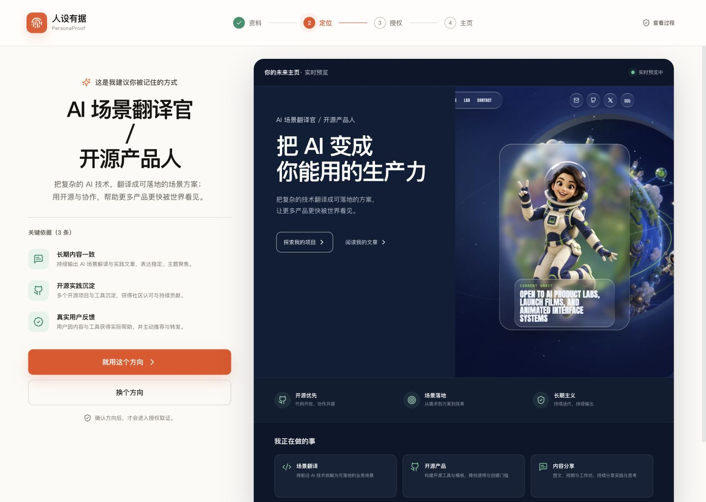
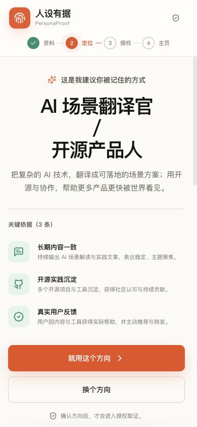

# 人设有据 PersonaProof × DeepSeek Harness

> 基于 DeepSeek Harness × AgentTeams 的长期个人品牌操作系统。

信息爆炸时代，最难的不是拥有内容，而是被看见、被记住。PersonaProof 不是替用户编一个人设，而是以简历、访谈和身份线索为起点，在用户确认方向和数据源后，主动检索 GitHub、公开网络、作品站、媒体以及公司官网/官方账号，寻找散落的作品、经历和第三方证明，再由不同职能 Agent 协作完成品牌策略、内容、视觉、定制个人主站、审核、发布与回滚。

## 这版替代什么

本目录的 `0.2.0` Harness 版替代早期静态参赛 Demo。旧版的治理合同、AgentTeams Identity、Skills 与 Schema 被保留并接入新运行面；原来的 `demo/` 页面不再是参赛主实现。

DeepSeek Harness 提供长期会话、工作区、主机插件、客户端 UI 插件和工具入口；AgentTeams 负责 8 个不同职能 Worker 的任务拆解、上下文传递、Leader 验收与退回；PersonaProof 提供个人品牌领域模型、同意闸门、Claim–Evidence Ledger、长期记忆和发布治理。

## 一个人，一份事实，多种场景表达

- 每位用户只有一个稳定主档案。
- 求职、创作、合作和社交版可以改变受众、重点、语气与视觉。
- 场景版本不能改写核心事实。
- 同名账号不会自动合并；来源归属必须由本人确认。

## 四道同意闸门

- **G0 长期档案**：不启用长期记忆也能完成单次服务；启用后可查看、暂停、撤销和删除。
- **G1 定位方向**：用户确认宣传方向、受众和不可公开信息。
- **G2 授权检索与取证**：按来源、用途、访问方式和期限授权；授权后 Agent 主动检索，未授权工具调用直接拒绝。
- **G3 公开发布**：QA 通过仍不能自动公开，必须由用户最终审阅。

## 真实 Harness 插件结构

```text
goai-persona-agent/
├── package.json                     DeepSeek Harness 固定版本与运行脚本
├── packages/
│   ├── personaproof-bundle/         Harness profile bundle
│   └── personaproof-plugin/
│       ├── src/index.js             主机端工具、系统约束与 AgentTeams 适配
│       ├── src/client.jsx           Harness 工作区 UI 插件
│       ├── src/domain.js            可测试的领域状态机
│       ├── src/store.js             本地可撤回工作区状态
│       └── src/styles.css           PersonaProof 视觉系统
├── agentteams/                      8 Worker + 1 Team 声明和项目 DAG
├── contracts/                       授权、证据和 Case State Schema
├── skills/                          可复用职能 Skills
├── scripts/                         profile、启动和确定性验证
└── tests/                           授权拒绝、Claim、QA 退回与回滚测试
```

## 本地运行

需要 Node.js 22.19+ 与 pnpm：

```bash
cd goai-persona-agent
pnpm install
pnpm test:all
pnpm start
```

默认地址：`http://127.0.0.1:3188`

打开后就是 C 端用户真正会看到的简洁流程，按下面顺序体验：

1. 查看系统推荐的“AI 场景翻译官 / 开源产品人”定位和三条事实依据；
2. 点击“就用这个方向”完成 G1；
3. 选择允许的检索范围，包括 GitHub、公开网络和公司官网/官方账号，完成 G2；
4. 生成个人主页，系统在后台完成主动检索、证据核验、8 个 Agent 的协作与一次 QA 退回；
5. 在发布前完成 G3 审阅；
6. 如需检查工程能力，再打开“查看依据与生成记录”查看证据、Trace、回滚和审计。

Demo 使用用户明确授权的参赛案例和公开主页效果图，不把简历原文、手机号、邮箱、凭据或私有来源快照写入仓库。

## 简洁主流程

| 桌面端：定位、依据与主页效果同屏 | 手机端：一步一件事 |
|---|---|
|  |  |

评委需要的 8-Agent 协作、Claim–Evidence Ledger、Trace、授权闸门和回滚没有删除，而是收进“查看依据与生成记录”，避免普通用户一上来就面对工程控制台。

## 参赛防守

网页只是最后一种交付。评委可以在同一工作区看到定位确认、未授权拒绝、AgentTeams 职能分工、Skill 调用、QA 退回、Claim–Evidence Ledger、发布审批和撤回回滚，因此它不是简历包装器、内容生成器或网页生成器。
